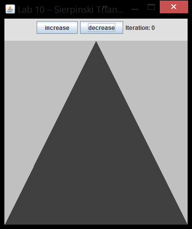
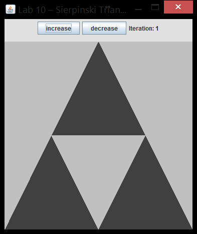
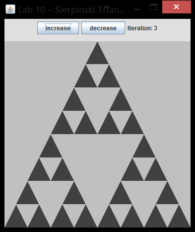
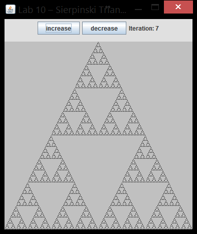

#Sierpinski Triangle

A Sierpinski Triangle is a fractal formed by drawing a triangle and then using the midpoints of each side of the triangle to form another triangle. This inner triangle is then removed. The result is three smaller triangles (one at the top and one in each corner) on which the process is repeated. After iteration N, the image will contain 3^N triangles, each of which is similar to the original triangle. Write a GUI-based program that implements a recursive algorithm for drawing a Sierpinski Triangle in a square drawing area as shown below. Provide two buttons to allow a user to increase and decrease the iteration value (N). Prevent this iteration value from being set to a value less than zero or greater than a value resulting in triangles with a size of less than one pixel (based on the size of the drawing area). Provide a label displaying the current iteration value. Examples below show the Sierpinski Triangle with an iteration value of 0 (minimum), 1, 4, and 7 (maximum for the drawing area size used below). You must use recursion and clearly document your code identifying the base case and recursive definitions as discussed in the textbook and lecture notes. 

************************************************************************************************************************************************************
Sample run:
************************************************************************************************************************************************************

